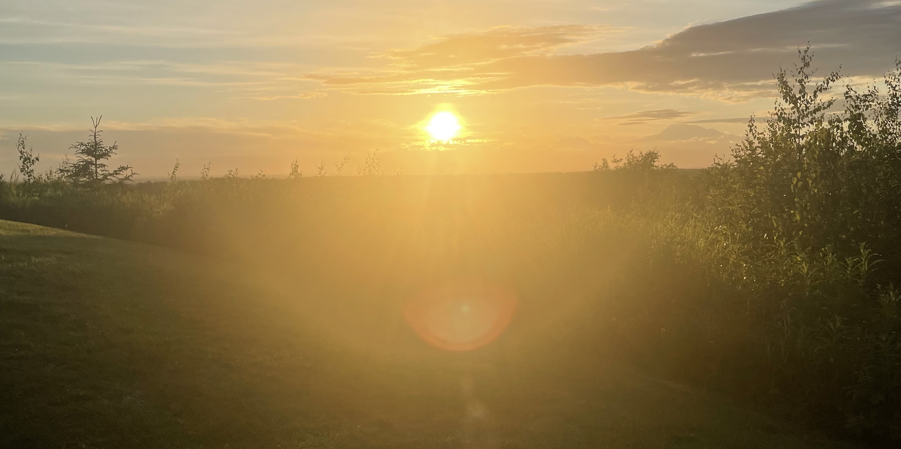

# 🌅 Impact Team Technical Assessment 2025-2026 🌅
Congratulations on reaching the next step of the application process! This phase is the most important one in the entire process, as it assesses your ability to create a web app using both tools you're familiar with and ones you probably aren't and will have to pick up as you go. This is one of the most important skills for a web developer to cultivate.

By **April 22nd at 11:59pm**, you must fork this repository and submit a PR (pull request) to this repository with both your completed version of the app and a screen recording of you walking me through your app's features.

## Your Task
Living in Boston, a city with what feels like very erratic sunrise and sunset times, I have always been interested in sunrise and sunset times across the world. I want you to make a full-stack web app using React, NodeJS, and MongoDB that allows the user to easily view sunrise and sunset times anywhere across the world, and tell them about places in totally different parts of the world with similar times.

In particular, your app should include the following features:
1. A catchy name and title with a cool font!
2. An interactive, pretty world map that spans most of the home page, using the [React Leaflet](https://react-leaflet.js.org/) library.
3. An [event](https://react-leaflet.js.org/docs/example-events/) that places a marker at your current location with a popup that displays the sunrise and sunset times of your location using the [Sunrise Sunset JS](https://www.npmjs.com/package/sunrise-sunset-js) library.
4. The popup should also display information about a place in a totally different part of the world with similar sunrise and sunset times. You should use the Google Gemini API for this, leveraging both system instructions and your individual queries to get the best result possible.
5. A separate history page that keeps track of locations you've tapped. This should include latitude, longitude, and some information about Google Gemini's response. You can include the whole response if you want, but making another call to Google Gemini to extract just the location to put on there would be extra cool! You can display this information in whatever format you want. Make sure you can get between your home and history pages by clicking on an icon, text, etc.

## Things to Consider
This task is tough and time-intensive! Try your best with it. I am really excited to see what you come up with. Please start working on it early, and budget your time well. I am going to be strict about the deadline.

You will notice that a lot of the tools I am asking you to use are ones you are probably not familiar with. This is on purpose, and all of these tools have (in my opinion) very clear documentation that you should be able to reference and use pretty easily.

I have a few pieces of advice for you:
- Don't skimp out on the frontend. I want your sites to look pretty, so really make an effort to give them a nice visual aesthetic. You are welcome to use a UI library such as [Material UI](https://mui.com/material-ui/all-components/).
- Remember to use your backend as a middleman between your APIs and your frontend. You should be able to copy a lot of your index.js file from the personal website with just a few modifications. You should be importing and calling the Sunrise Sunset JS library in your backend too, passing in latitude and longitude coordinates as a POST request, like what we did for our AI chatbot POST request. You should just be passing in the coordinates for your AI POST request as well, and writing the rest of the query yourself.
- Don't forget to put any private information, such as API keys, in your .env file. Put the .env file in your .gitignore so it is not pushed onto GitHub.
- This isn't as clear as I would like on the Leaflet API, but you can pass in an event as a parameter `e` to the click function in useMapEvents and access your the location you clicked using `e.latlng`. This information in conjunction with the the [events](https://react-leaflet.js.org/docs/example-events/) page on the Leaflet documentation should be enough to allow you to implement this feature.
- Feel free to use my technical assessment when I applied for Impact Team, [Our Republic](https://our-republic.vercel.app/), as a model and a guide for you. It has some of the features we didn't cover in the JDT workshops, such as multiple pages, so feel free to copy my main.jsx code from there when working to implement that. You can access the code for it [here](https://github.com/adam-godel/our-republic/).
  
Most importantly, try your best to just make something you're proud of! **If you're unable to implement every feature of the site, that's okay, just submit whatever you have.** Please really try to give yourself the time you need to work on it, though.

## A Note on LLMs
You are welcome to use LLMs to help you with anything you need for this project. However, please make sure you understand any code produced by a LLM that you use, since I may be asking you about your code during the interview, if you are invited to it.

## Good Luck!
I'm really excited to see what you produce! Try your best with it and don't worry if you can't figure out everything. Submit whatever you have as a PR following the template in [pr_template.md](pr_template.md). I hope you enjoy working on this and feel proud enough of it to use it as a project or a demo of your abilities on your portfolio :)

### *~ Off the coast of Athens ~*
